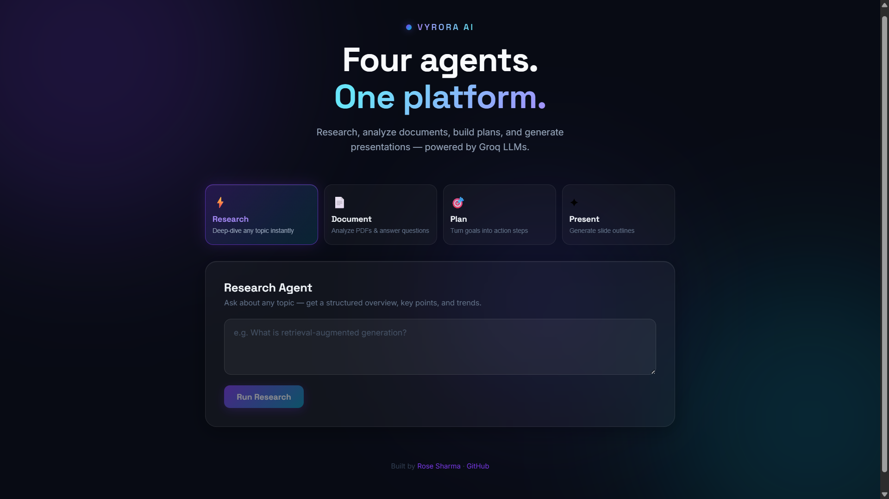
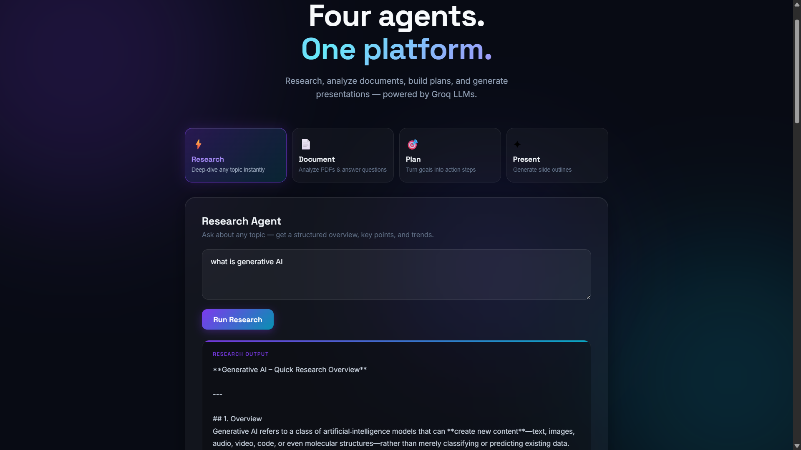

# Vyrora AI

[](https://fastapi.tiangolo.com/)
[](https://vitejs.dev/)
[](https://groq.com/)
[](https://render.com/)
[](https://vercel.com/)
[](#license)

A multi-agent AI platform with a FastAPI backend and a React frontend. A lightweight router directs each request to one of four specialized agents, all powered by Groq's LLM API.

**Live App:** https://vyrora-ai-agent-platform.vercel.app
**Backend API:** https://vyrora-ai-agent-platform.onrender.com

> **Note:** Backend runs on Render's free tier and spins down after inactivity.
> First request after idle may take 30–50 seconds. This is a platform limitation, not a bug.

---

## Screenshots




## Overview

Vyrora AI demonstrates a practical, production-deployable multi-agent architecture without unnecessary complexity. Instead of a heavyweight orchestration framework, a simple keyword-based supervisor routes requests — appropriate for four independent agents with no shared state between them.

## Features

| Agent | Description |
|---|---|
| **Research Agent** | Takes a topic or question and returns a structured overview, key points, and relevant trends |
| **Document Agent** | Accepts a PDF or text file, extracts content, returns a summary and key points, and answers follow-up questions |
| **Planning Agent** | Takes a goal and returns a concrete numbered action plan with a flagged risk or blocker |
| **Presentation Agent** | Takes a topic and returns a structured slide-by-slide outline with title and bullet points per slide |

## Scope & Design Decisions

Documenting what was intentionally left out, and why:

- **No vector database / RAG pipeline.** Document Q&A passes extracted text directly into the prompt. Sufficient for typical document lengths and avoids vector store overhead on free-tier infrastructure where persistent storage isn't reliable.
- **No LangGraph or graph-based orchestration.** Four independent agents with no shared state don't need it. A keyword router achieves the same result with fewer failure points.
- **No authentication or persistent storage.** Every request is stateless by design, keeping the project lightweight and appropriate for its current scope.

## Tech Stack

**Backend**
- FastAPI
- Groq API (`openai/gpt-oss-120b`)
- pypdf (PDF text extraction)

**Frontend**
- React (Vite)
- Axios

**Deployment**
- Render (backend)
- Vercel (frontend)

## Project Structure
```
vyrora-ai-agent-platform/
├── backend/
│   ├── agents/
│   │   ├── research_agent.py
│   │   ├── document_agent.py
│   │   ├── task_agent.py              # planning agent
│   │   ├── presentation_agent.py
│   │   └── supervisor.py             # keyword-based router
│   ├── api/
│   │   └── routes.py                 # all API endpoints
│   ├── services/
│   │   └── groq_service.py           # LLM API wrapper
│   ├── main.py                       # FastAPI app entrypoint
│   ├── requirements.txt
│   └── .env.example
├── frontend/
│   ├── src/
│   │   ├── App.jsx                   # full UI, tabbed by agent
│   │   └── main.jsx
│   ├── index.html
│   ├── package.json
│   ├── vite.config.js
│   ├── vercel.json
│   └── .env.example
├── render.yaml
└── README.md
```

## Getting Started Locally

### Prerequisites

- Python 3.10+
- Node.js 18+
- A free [Groq API key](https://console.groq.com/keys)

### Backend

```bash
cd backend
pip install -r requirements.txt
cp .env.example .env
# Add your GROQ_API_KEY to .env
uvicorn main:app --reload
```

Runs at `http://127.0.0.1:8000` — API docs at `/docs`.

### Frontend

```bash
cd frontend
npm install
cp .env.example .env
# Set VITE_API_URL=http://127.0.0.1:8000
npm run dev
```

## Deployment

### Backend → Render

1. Push repo to GitHub
2. New + → Web Service → connect repo
3. Language: Python 3
4. Root Directory: `backend`
5. Build Command: `pip install -r requirements.txt`
6. Start Command: `uvicorn main:app --host 0.0.0.0 --port $PORT`
7. Add env var: `GROQ_API_KEY`
8. After frontend deploy, add `FRONTEND_ORIGIN` = your Vercel URL

`render.yaml` included for Infrastructure-as-Code import.

### Frontend → Vercel

1. New Project → import repo
2. Root Directory: `frontend`
3. Framework: Vite (auto-detected)
4. Add env var: `VITE_API_URL` = your Render backend URL
5. Deploy

## API Reference

| Endpoint | Method | Request Body | Response |
|---|---|---|---|
| `/research` | POST | `{"question": "..."}` | `{"response": "..."}` |
| `/plan` | POST | `{"goal": "..."}` | `{"response": "..."}` |
| `/presentation` | POST | `{"topic": "..."}` | `{"slides": [...]}` |
| `/document/upload` | POST | multipart file | `{"analysis": "...", "extracted_text": "..."}` |
| `/document/ask` | POST | `{"text": "...", "question": "..."}` | `{"response": "..."}` |
| `/route` | POST | `{"question": "..."}` | `{"agent": "agent_name"}` |
| `/health` | GET | — | `{"status": "ok"}` |

## Roadmap

- [ ] Persistent vector storage for large document Q&A
- [ ] User authentication and session history
- [ ] Streaming responses for long-form output

## License

MIT

## Author

**Rose Sharma**
[GitHub](https://github.com/Rosesharma13) · [LinkedIn](https://linkedin.com/in/rose-sharma13) · [Portfolio](https://rosesharma13.github.io)
